# Letterboxd Dataset: Exploratory Data Analysis

## 1. Dataset Overview

The dataset contains **941,597 movies** from Letterboxd organized in a star schema: a central `movies` table joined by `id` to 9 related tables.

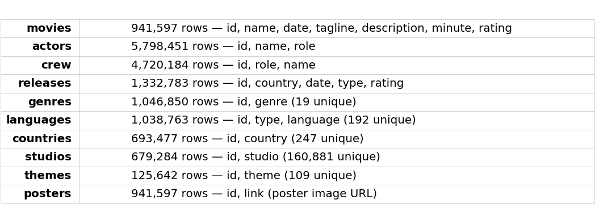

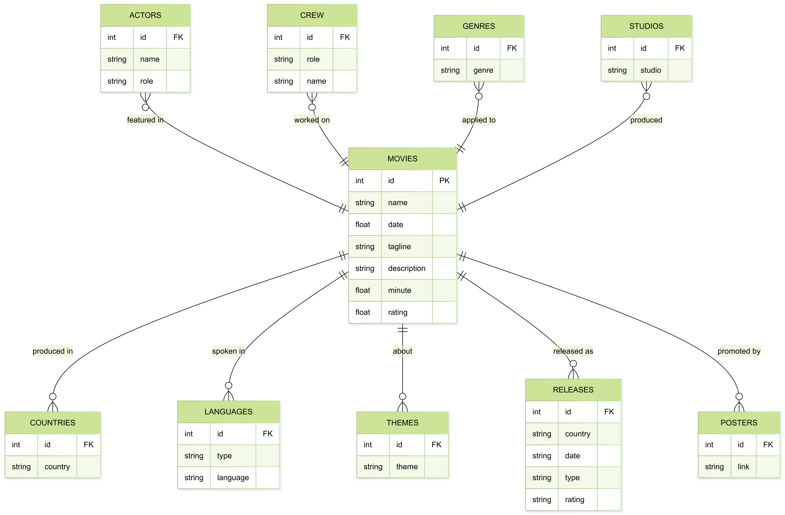

---

## 2. Data Quality & Missing Values

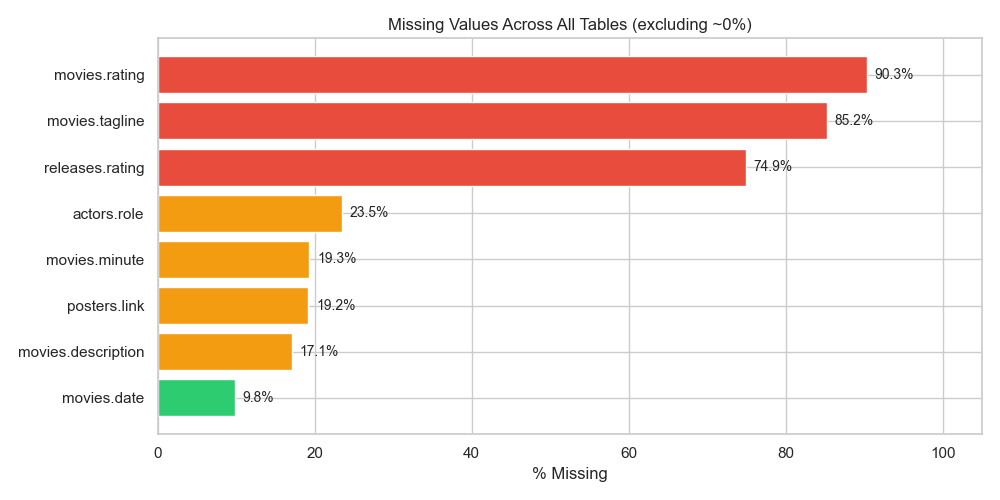

It is interesting to see that 90% of movies do not have an average rating or tagline! We have seen in the data that only more recent movies (from 1990-2000 onwards) have a rating. This might be problematic when trying to provide rating-related visualizations. The remaining gaps (runtime 19%, description 17%, date 10%) are moderate and manageable.

---

## 3. Feature Analysis

### Ratings

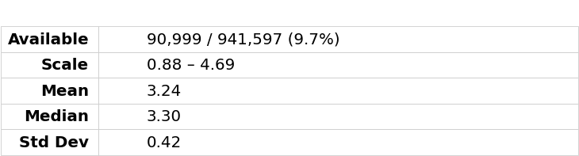

The distribution is **left-skewed**, the reason for this is that users on Letterboxd tend to rate positively, with the bulk of ratings between 3.0 and 3.5. Very few movies fall below 2.0. The median (3.30) sits above the mean (3.24), confirming the negative skew.

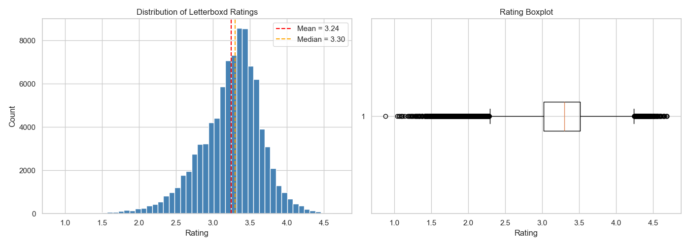

### Release Year

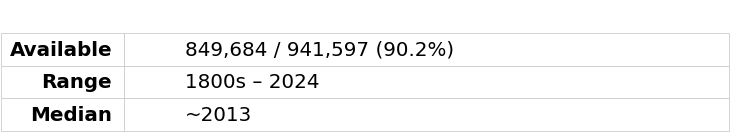

Movie production volume seems to grow **exponentially** over the decades, with a sharp peak in the 2020s. There is a noticeable dip around 2020 (probably caused by the COVID-19 impact). The vast majority of entries are from 1990 onward.

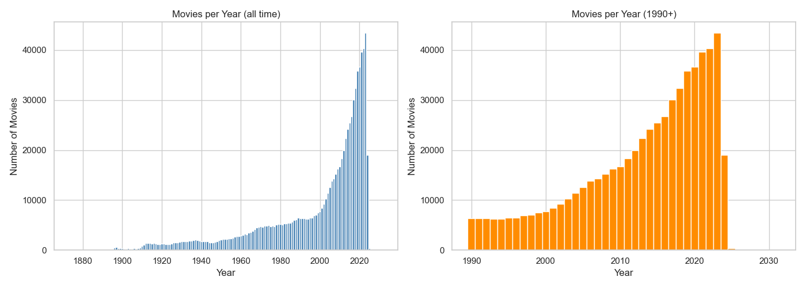

---

### Movie Duration

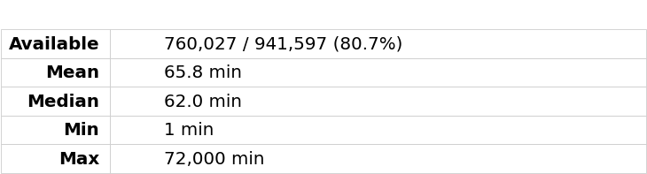

The length distribution reveals **three distinct groups**:

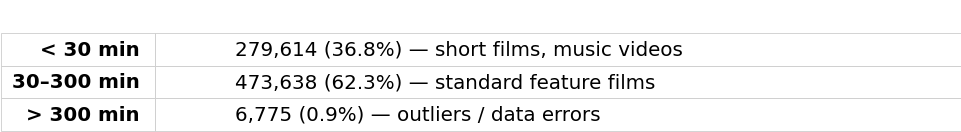

The **short film segment is surprisingly large** (37%) and pulls the overall mean down to 66 min. Within the standard range (30–300 min), the mean is ~97 min, which is closer to what we would expect for feature films. The extreme outliers (up to 72,000 min = 50 days) are clearly erroneous and must be filtered.

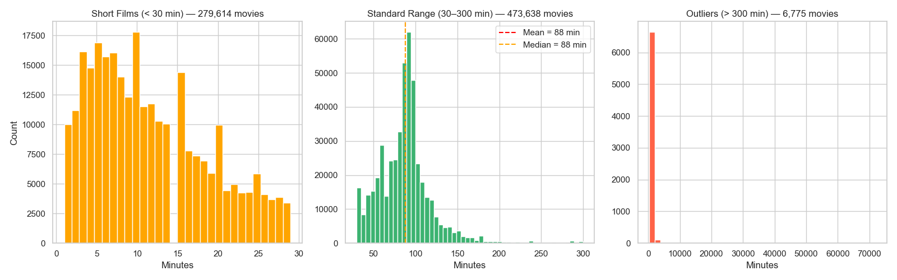

---

### Genres

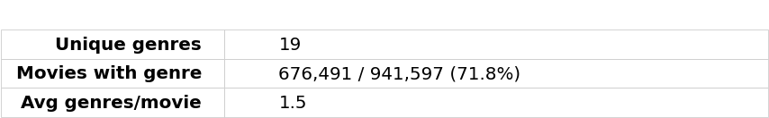

**Drama** dominates with 232K entries, followed by Documentary (164K) and Comedy (141K). Each movie can have multiple genre tags (up to 17, though 1–2 is typical).

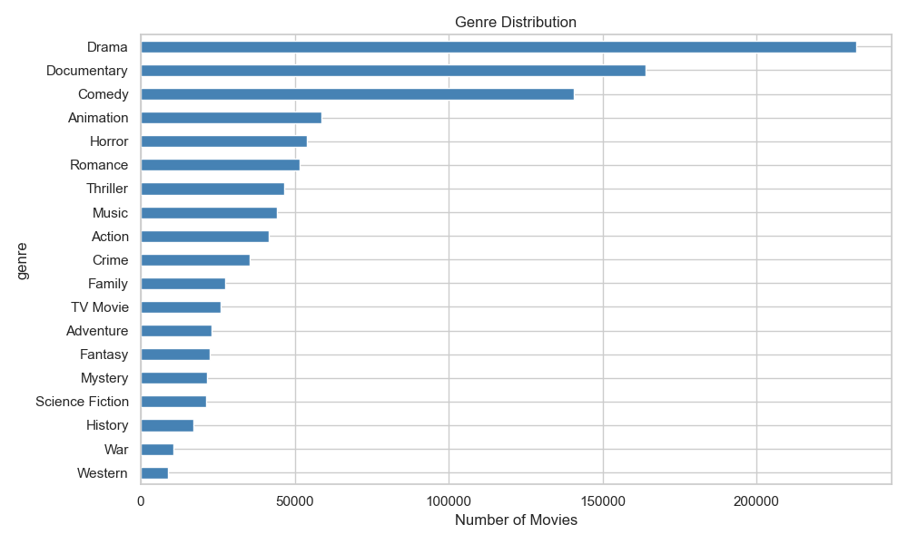

History and War films rate highest (mean ~3.45). Horror and TV Movie rate lowest (~3.05). All genres cluster within a narrow 0.4-point band, suggesting genre alone is not a strong predictor of rating.

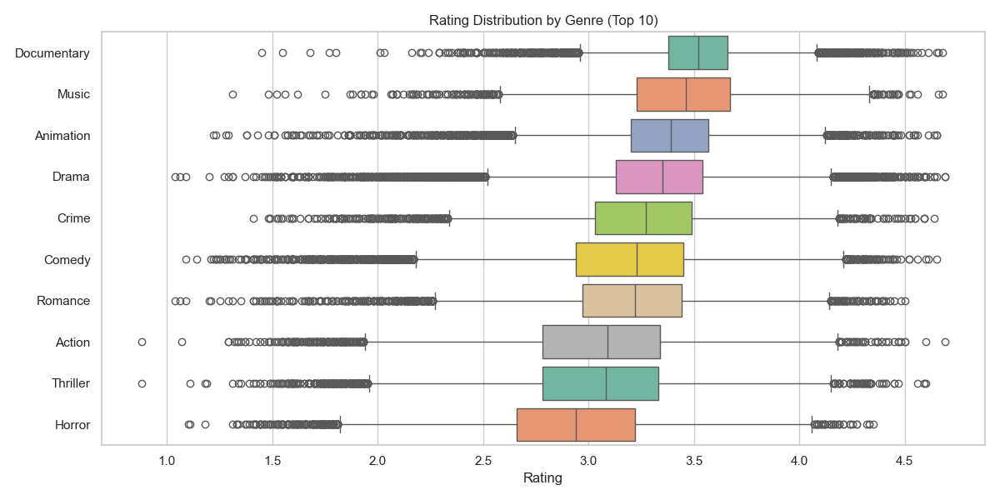

Drama has always dominated. Documentary surged from the 2000s onward. Horror and Animation have grown steadily since the 1980s.

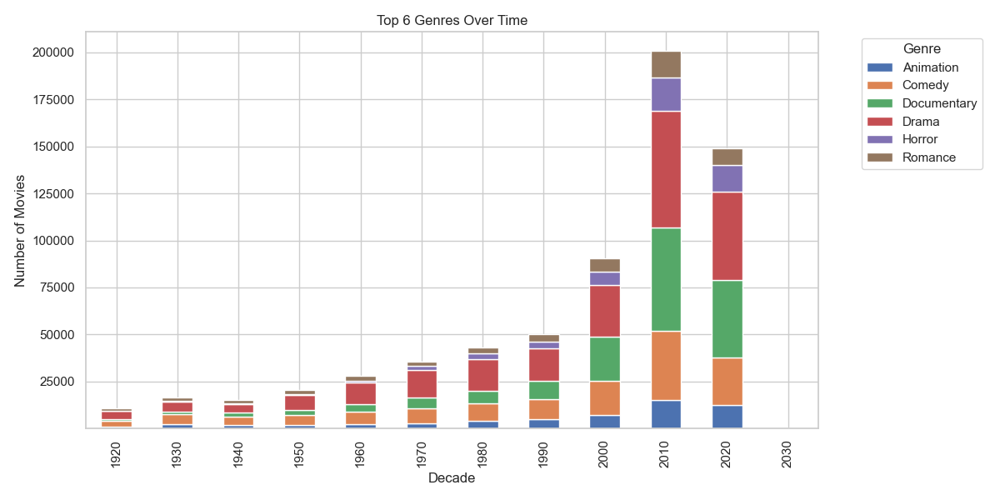

---

### Actors

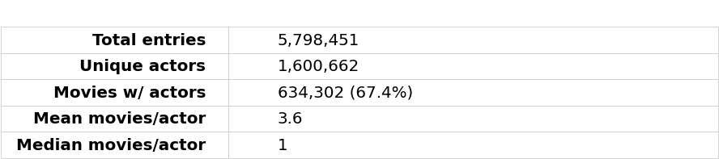

The actor distribution is **extremely long-tailed**: the median actor appears in only 1 movie, while the most prolific (Mel Blanc) appears in 1,058. Most actors in the database are one-time appearances.

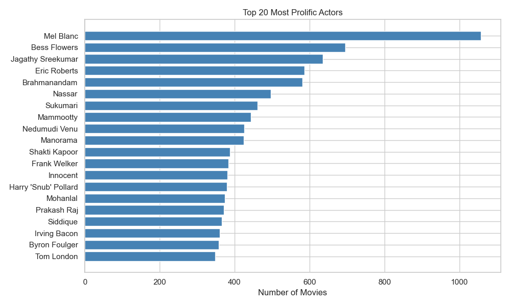

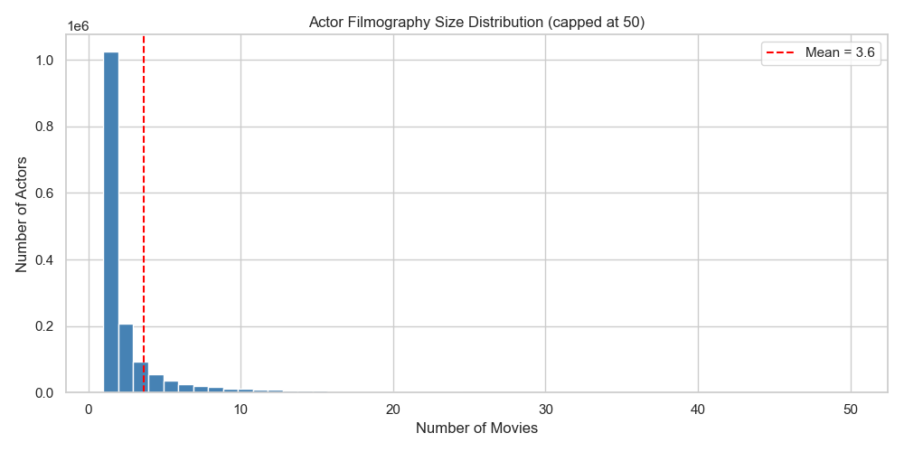

---

### Languages

**English** dominates with 473K entries (45% of all language assignments). The `type` column distinguishes between "Primary language" (57K entries), "Language" (848K), and "Spoken language" (133K). Among primary languages, English leads (21.8K), followed by French (5.2K) and German (4K).

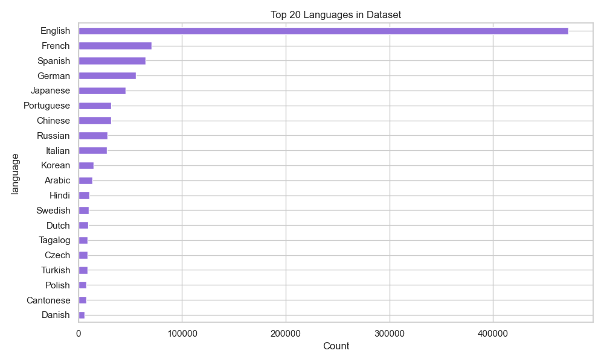

---

### Countries

The **USA** accounts for 174K movies, 3.8x more than second-place France (46K). The top 5 (USA, France, UK, Japan, Germany) represent the bulk of cataloged films.

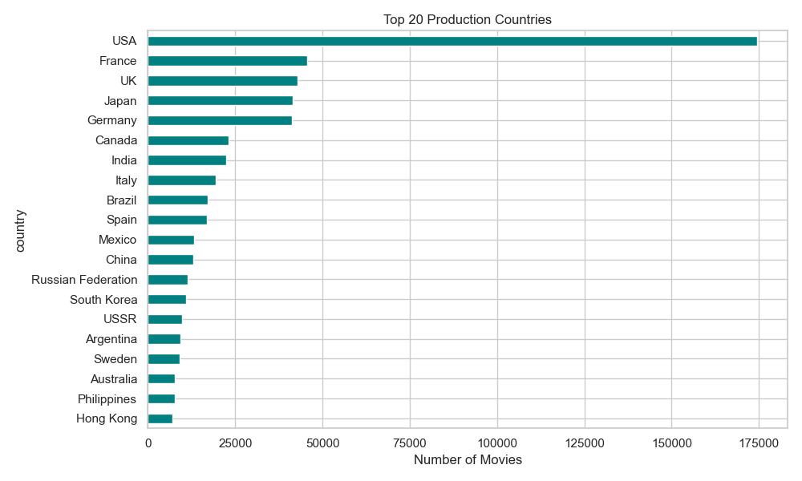

Among the top 15 producing countries, **USSR** and **Japan** rate highest (3.62 and 3.43 respectively), the USSR figure likely reflects survivorship bias (only notable Soviet films are cataloged). **Canada** and **USA** rate lowest (~3.08 and 3.15). This may reflect the sheer volume of low-budget productions from English-speaking countries in the database.

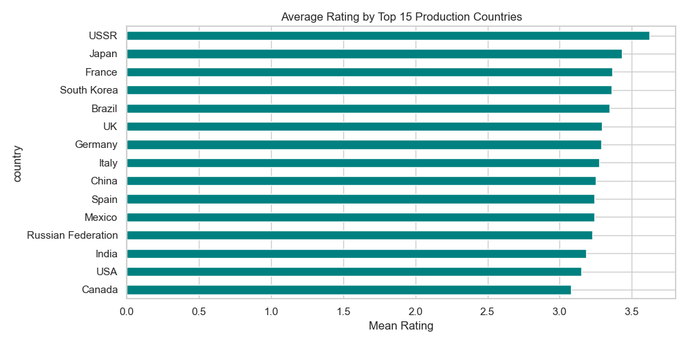
